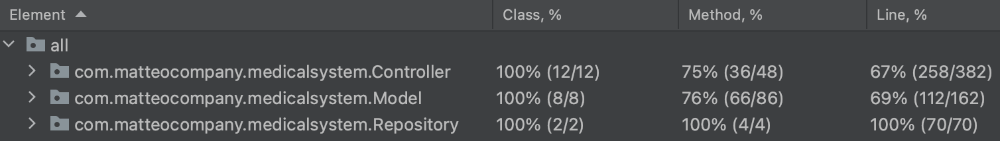

# Documentazione "MedicalSystem"

## Introduzione
Come progetto per l'esame di Fondamenti di Ingegneria del Software ho scelto "MentCare" e realizzato una webApp con framework Java Spring con
pattern MVC.

DISCLAIMER: purtroppo non ho aggiunto tutti gli scenari che avrei voluto ma, per mancanza di tempo (lavoro a tempo pieno) non sono riuscito a portarli a termine. Ho cercato però, dove ci potevano essere scenari ripetuti per più attori, di crearli solo per uno in modo da fungere come esempio.
## Requisiti
***
### Attori
+ I medici e i pazienti possono essere aggiunti solo ed esclusivamente da un amministratore di sistema che fornisce loro le credenziali.
+ Gli amministratori sono già registrati nell'applicazione, non è prevista la possibilità di aggiungere nuovi amministratori.
+ All' avvio dell' applicazione sono presenti i seguenti utenti di default:
    + PATIENT: Username: "mariorossi" Password: "password"
    + PATIENT: Username: "marcobianchi" Password: "password"
    + PATIENT: Username: "rosaferri" Password: "password"
    + PATIENT: Username: "enricopiazza" Password: "password"
    + PATIENT: Username: "angelamanna" Password: "password"
    + PATIENT: Username: "luisarusso" Password: "password"
    + PATIENT: Username: "albertopalermo" Password: "password"
    + DOCTOR: Username: "angelicamancini" Password: "password"
    + DOCTOR: Username: "vincenzotrevisano" Password: "password"
    + DOCTOR: Username: "giudittatrentino" Password: "password"
    + ADMIN: Username: "admin" Password: "admin"
#### Paziente
1. Il paziente ha la possibilità di visualizzare le proprie informazioni personali.
2. In particolare, il paziente può vedere il suo medico curante se ne ha uno, altrimenti vedrà il campo vuoto.
3. Il paziente può accendere alla propria area personale mediante le credenziali fornite.
   (username e password scelta dall' amministratore di sistema)

#### Medico

1. Il medico ha la possibilità di visualizzare le proprie informazioni personali.
2. In particolare, il medico può vedere i suoi pazienti se ne ha almeno uno, altrimenti vedrà un campo vuoto.
3. Il medico può accendere alla propria area personale mediante le credenziali fornite.
   (username e password scelta dall' amministratore di sistema)

#### Amministratore di sistema

1. L'amministratore può visualizzare tutti i medici e i pazienti presenti nel sistema.
2. L'amministratore può aggiungere nuovi pazienti al sistema inserendo le informazioni richieste.
3. L'amministratore può aggiungere nuovi medici al sistema inserendo le informazioni richieste.
4. L'amministratore può eliminare qualsiasi medico presente nel sistema.
5. L'amministratore può modificare ogni paziente presente nel sistema.
6. L'amministratore può aggiungere un medico curante tra quelli disponibili a un paziente.

## Scenari
***
### 1. Aggiunta Paziente

**Assunzione iniziale:** Perchè l' amministratore possa aggiungere un nuovo paziente è necessario che l' amministratore sia
correttamente entrato nell' applicazione.

**Normale:** L'amministratore crea un nuovo paziente nel sistema per far si che il nuovo utente possa accedere all' applicazione. Può farlo cliccando sul link "New Patient" sotto la lista dei pazienti.
Si viene quindi diretti ad un form in cui inserire gli appositi dati e, cliccando su submit, questi vengono inseriti.

**Cosa può andare storto:** Potrebbe esserci un problema relativo all'inserimento di una stringa non corretta.

**Stato del sistema al termine:** Il paziente viene correttamente inserito in memoria, viene mostrata la schermata dell'admin in cui, nella lista dei pazienti, c'è anche il nuovo paziente inserito.

### 2. Modifica Paziente

**Assunzione iniziale:** Perchè l' amministratore possa modificare un paziente è necessario che l' amministratore sia
correttamente entrato nell' applicazione e che il paziente da modificare sia presente nel sistema.

**Normale:** L'amministratore modifica un certo numero di informazioni memorizzate di un paziente nel sistema in modo da aggiornare le informazioni attualmente presenti.
Per fare ciò l' amministratore clicca sul link "edit" presente nella riga della tabella associata al paziente da modificare.
Una volta modificati i dati desiderati, il paziente modificato viene salvato nel sistema.

**Cosa può andare storto:** Potrebbe esserci un problema relativo all'inserimento di una stringa non corretta o al fatto che il paziente non venga trovato nella repository, a quel punto si visualizzerebbe la pagina "Not Found".

**Stato del sistema al termine:** Il paziente è stato correttamente modificato nel sistema e le modifiche saranno visibili da
tutti gli utenti che hanno la possibilità di visualizzare tali informazioni, ovvero il paziente stesso e gli
amministratori.

### 3. Aggiunta Medico

**Assunzione iniziale:** Perchè l' amministratore possa aggiungere un nuovo medico è necessario che l' amministratore sia
correttamente entrato nell' applicazione.

**Normale:** L'amministratore crea un nuovo medico nel sistema per far si che il nuovo medico possa accedere all' applicazione. Può farlo cliccando sul link "New Doctor" sotto la lista dei medici.
Si viene quindi diretti ad un form in cui inserire gli appositi dati e, cliccando su submit, questi vengono inseriti.

**Cosa può andare storto:** Potrebbe esserci un problema relativo all'inserimento di una stringa non corretta.

**Stato del sistema al termine:** Il medico viene correttamente inserito in memoria, viene mostrata la schermata dell'admin in cui, nella lista dei medici, c'è anche il nuovo medico inserito.

### 4. Eliminazione Medico

**Assunzione iniziale:** Perchè l' amministratore possa eliminare un medico è necessario che l' amministratore sia
correttamente entrato nell' applicazione e che il medico da eliminare sia presente nel sistema.

**Normale:** L'amministratore clicca sul link "delete" presente nella riga della tabella associata al medico da eliminare.
Una volta cliccato, il medico verrà eliminato dal sistema.

**Cosa può andare storto:** Potrebbe esserci un problema relativo al fatto che il medico non venga trovato nella repository, a quel punto si visualizzerebbe la pagina "Not Found".

**Stato del sistema al termine:** Il medico è stato correttamente eliminato dal sistema e non sarà più visualizzato dalla corrispondente lista nella schermata dell'admin.

### 5. Aggiunta Medico Curante

**Assunzione iniziale:** Perchè l'amministratore possa aggiungere un nuovo medico curante per un paziente è necessario che il paziente
non abbia già un medico curante e che esista almeno un medico nel sistema.

**Normale:** L'amministratore deve cliccare sul link "Add Doctor" e si troverà su una schermata con la lista dei dottori disponibili.
Cliccando su choose il dottore verrà assegnato al paziente selezionato.

**Cosa può andare storto:** Il medico non è stato trovato oppure non ci sono medici disponibili.

**Stato del sistema al termine:**  Si visualizzerà la lista dei pazienti e
a fianco al paziente in questione verrà visualizzato il nome del medico curante selezionato.

### 6. Visualizzazione profilo Medico

**Assunzione iniziale:** Perchè il medico possa visualizzare la sua schermata deve essere correttamente entrato nell'applicazione.

**Normale:** Il medico logga e visualizza i suoi dati ovvero: username, nome, cognome, indirizzo, numero di telefono e specializzazione.

**Cosa può andare storto:** Non trova il medico, viene visualizzato "Not Found".

**Stato del sistema al termine:** Rimane la pagina aperta finché non si clicca su Log Out.

### 7. Visualizzazione profilo paziente

**Assunzione iniziale:** Perchè il paziente possa visualizzare la sua schermata deve essere correttamente entrato nell'applicazione.

**Normale:** Il paziente logga e visualizza i suoi dati ovvero: username, nome, cognome, indirizzo e numero di telefono.

**Cosa può andare storto:** Non trova il paziente, viene visualizzato "Not Found".

**Stato del sistema al termine:** Rimane la pagina aperta finché non si clicca su Log Out.

### 8. Visualizzazione admin

**Assunzione iniziale:** Perchè l'admin possa visualizzare la sua schermata deve essere correttamente entrato nell'applicazione.

**Normale:** Il medico logga e visualizza la lista dei pazienti, con i relativi link per aggiungere un medico curante, modificarlo e visualizzarlo, e la lista dei medici, con i relativi link
per visualizzarlo ed eliminarlo.

**Cosa può andare storto:** /

**Stato del sistema al termine:** Rimane la pagina aperta finche non si clicca su Log Out o su qualche azione fattibile su pazienti o medici.

# Guida
Per avviare l'applicazione:
1. Eseguire il main ServingWebContentApplication (contentuto in java.medcare.Controller).
2. Accedere al sito "http://localhost:8080/".
3. Per effettuare il login inserire una delle credenziali scritte nella sezione "Attori" ("admin", "admin" per entrare come amministratore).

# Test
Abbiamo realizzato Unit Tests utilizzando il framework JUnit per testare le unità dell' applicazione.
Abbiamo realizzato classi Service che forniscono ai Controller funzioni che eseguono varie operazioni.
Tali funzioni sono state testate ottenendo i seguenti risultati:

P.S. Le funzioni non testate sono astrazioni di query al database (che supponiamo corrette), l'inserimento e la cancellazione
di session Cookies e i Getter and Setter autogenereti del model (che assumiamo corretti).

Abbiamo inoltre realizzato Assurence Tests utilizzando Selenium WebDriver per testare l'interazione utente-sistema.
I test realizzati riassumono le principali attività che i vari utenti possono svolgere nel sistema tramite interfaccia grafica.

# Autore
***
Marjanovic Matteo